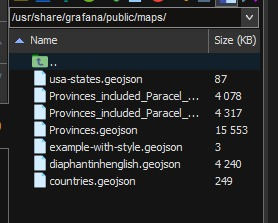

# Hướng dẫn SSH và Upload File GeoJSON lên EC2 Linux cho Grafana



## Tổng quan

Tài liệu này hướng dẫn cách kết nối SSH vào EC2 Linux instance và upload các file GeoJSON vào thư mục maps của Grafana để hiển thị bản đồ tùy chỉnh.

## Yêu cầu

- EC2 Linux instance đang chạy
- Key pair (.pem file) để kết nối SSH
- Quyền sudo trên EC2 instance
- Grafana đã được cài đặt trên EC2

## Các file GeoJSON cần upload

- `Provinces_included_Paracel_SpratlyIslands.geojson` - Dữ liệu các tỉnh thành Việt Nam bao gồm Hoàng Sa và Trường Sa
- `Provinces_included_Paracel_SpratlyIslands_combine.geojson` - Dữ liệu tỉnh thành đã được kết hợp

## Bước 1: Kết nối SSH vào EC2 Linux

### 1.1 Chuẩn bị key pair

```bash
# Đảm bảo key pair có quyền đúng (chỉ owner có thể đọc)
chmod 400 /path/to/your-key.pem
```

### 1.2 Kết nối SSH

```bash
# Thay thế các thông tin sau:
# - your-key.pem: tên file key pair của bạn
# - ec2-user: username (có thể là ubuntu, centos, admin tùy AMI)
# - your-ec2-public-ip: địa chỉ IP public của EC2 instance

ssh -i /path/to/your-key.pem ec2-user@your-ec2-public-ip
```

**Ví dụ:**

```bash
ssh -i ~/Downloads/my-grafana-key.pem ec2-user@54.123.45.67
```

### 1.3 Các username phổ biến theo AMI

- **Amazon Linux 2**: `ec2-user`
- **Ubuntu**: `ubuntu`
- **CentOS**: `centos`
- **RHEL**: `ec2-user`
- **Debian**: `admin`

## Bước 2: Thay đổi quyền thư mục Grafana maps

### 2.1 Kiểm tra thư mục hiện tại

```bash
ls -la /usr/share/grafana/public/maps/
```

### 2.2 Thay đổi quyền sở hữu thư mục

```bash
# Thay đổi owner thành user hiện tại để có thể upload file
sudo chown -R $USER:$USER /usr/share/grafana/public/maps/

# Hoặc thay đổi thành user cụ thể (thay 'ec2-user' bằng username của bạn)
sudo chown -R ec2-user:ec2-user /usr/share/grafana/public/maps/
```

### 2.3 Cấp quyền ghi

```bash
# Cấp quyền đọc, ghi, thực thi cho owner và group
sudo chmod -R 755 /usr/share/grafana/public/maps/
```

### 2.4 Xác nhận thay đổi

```bash
ls -la /usr/share/grafana/public/maps/
```

## Bước 3: Upload file GeoJSON

### 3.1 Sử dụng SCP từ máy local

Mở terminal mới trên máy local (không phải SSH session):

```bash
# Upload file đầu tiên
scp -i /path/to/your-key.pem \
    ./Provinces_included_Paracel_SpratlyIslands.geojson \
    ec2-user@your-ec2-public-ip:/usr/share/grafana/public/maps/

# Upload file thứ hai
scp -i /path/to/your-key.pem \
    ./Provinces_included_Paracel_SpratlyIslands_combine.geojson \
    ec2-user@your-ec2-public-ip:/usr/share/grafana/public/maps/
```

### 3.2 Sử dụng rsync (khuyến nghị)

```bash
# Upload cả hai file cùng lúc
rsync -avz -e "ssh -i /path/to/your-key.pem" \
    ./*.geojson \
    ec2-user@your-ec2-public-ip:/usr/share/grafana/public/maps/
```

### 3.3 Upload qua SSH session (nếu file đã có trên server)

Nếu file đã được upload vào thư mục khác trên EC2:

```bash
# Di chuyển file từ thư mục khác
sudo mv /path/to/source/*.geojson /usr/share/grafana/public/maps/

# Hoặc copy
sudo cp /path/to/source/*.geojson /usr/share/grafana/public/maps/
```

## Bước 4: Xác nhận và khởi động lại Grafana

### 4.1 Kiểm tra file đã upload

```bash
ls -la /usr/share/grafana/public/maps/*.geojson
```

### 4.2 Đảm bảo quyền file đúng

```bash
sudo chown grafana:grafana /usr/share/grafana/public/maps/*.geojson
sudo chmod 644 /usr/share/grafana/public/maps/*.geojson
```

### 4.3 Khởi động lại Grafana

```bash
# Với systemd
sudo systemctl restart grafana-server

# Hoặc với service
sudo service grafana-server restart
```

### 4.4 Kiểm tra trạng thái Grafana

```bash
sudo systemctl status grafana-server
```

## Bước 5: Sử dụng trong Grafana

1. Đăng nhập vào Grafana web interface
2. Tạo dashboard mới hoặc chỉnh sửa dashboard hiện có
3. Thêm panel Geomap
4. Trong cấu hình layer, chọn "GeoJSON" làm data source
5. Đường dẫn file: `/public/maps/Provinces_included_Paracel_SpratlyIslands.geojson`

## Xử lý sự cố

### Lỗi Permission Denied

```bash
# Kiểm tra quyền thư mục
ls -la /usr/share/grafana/public/
sudo chown -R grafana:grafana /usr/share/grafana/public/maps/
```

### Lỗi SSH Connection

- Kiểm tra Security Group có mở port 22
- Xác nhận IP public của EC2
- Đảm bảo key pair đúng và có quyền 400

### File không hiển thị trong Grafana

- Khởi động lại Grafana service
- Kiểm tra đường dẫn file trong cấu hình
- Xem log Grafana: `sudo journalctl -u grafana-server -f`

## Lưu ý bảo mật

1. **Key Management**: Không chia sẻ private key, lưu trữ an toàn
2. **Security Groups**: Chỉ mở port SSH (22) cho IP cần thiết
3. **User Permissions**: Sử dụng principle of least privilege
4. **File Permissions**: Đảm bảo file GeoJSON chỉ có quyền đọc cho web server

## Tài liệu tham khảo

- [AWS EC2 User Guide](https://docs.aws.amazon.com/ec2/)
- [Grafana Geomap Documentation](https://grafana.com/docs/grafana/latest/panels/visualizations/geomap/)
- [SSH Best Practices](https://www.ssh.com/academy/ssh/best-practices)

---
